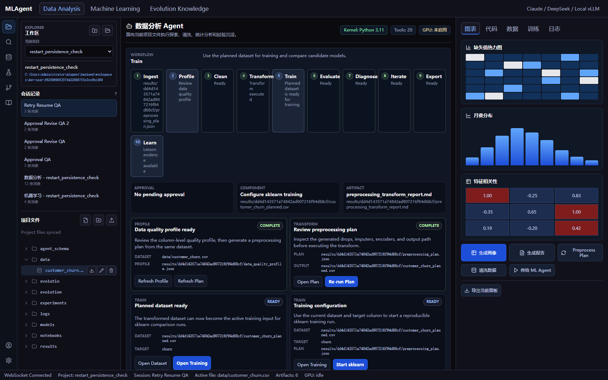
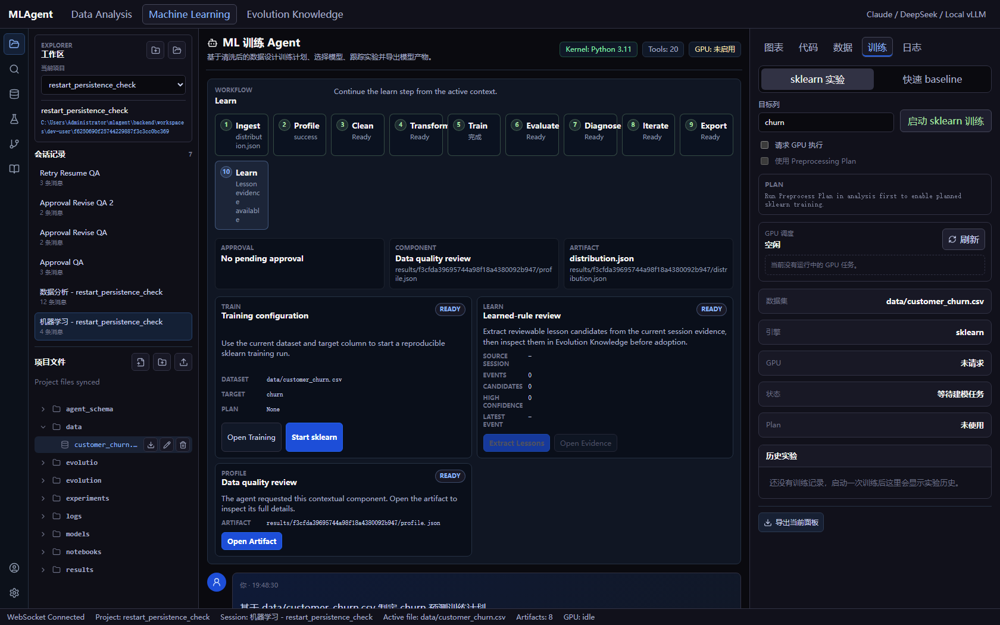
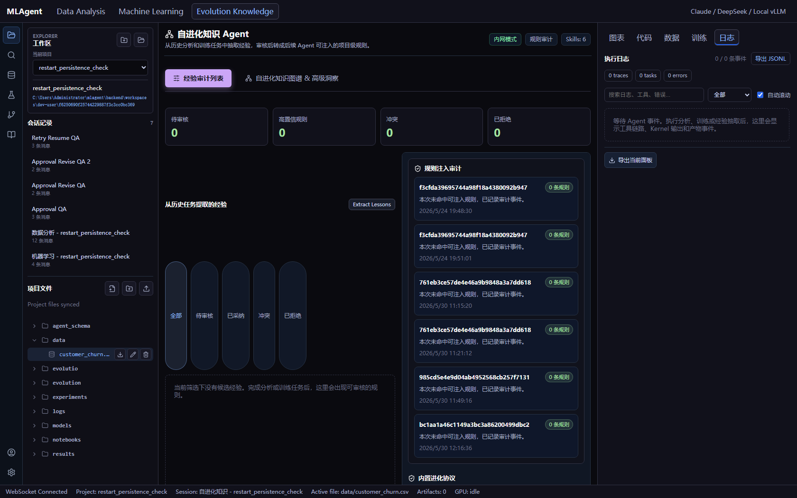
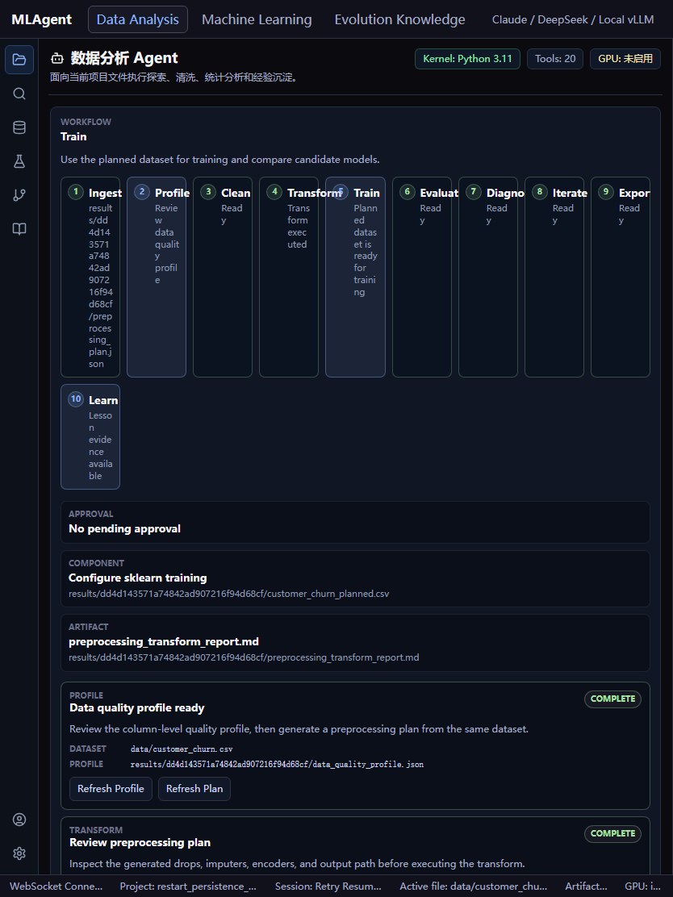
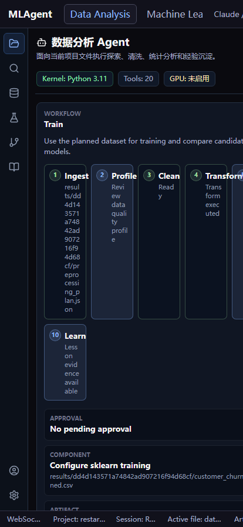

# MLAgent 生产级产品质量评估报告

> 评估对象：MLAgent —— 面向企业内部数据科学家的「对话式数据分析 + ML 建模」AI IDE 平台
> 评估视角：以**生产级 SaaS 产品**标准，审视代码架构、代码质量、实际使用效果与 UI/视觉
> 对标产品：数据/ML 平台（Hex / Deepnote / Databricks / Colab）、AI 编码 IDE（Cursor / Copilot Workspace / VS Code for Web）、通用设计标杆（Linear / Vercel / Notion / Stripe）

| 项目 | 内容 |
|------|------|
| 评估日期 | 2026-06-13 |
| 代码版本 | 分支 `codex/foundation-kernel-mvp` @ `f5df1c5` |
| 技术栈 | 后端 FastAPI(Python 3.11) · 前端 React 19 + Vite 6 + TypeScript |
| 评估方法 | 全量源码静态审查 + 文档审查 + **实际运行应用并截图取证**（后端 :8000 + 前端 dist :5174 + Chrome 无头截图） |
| 代码规模 | 后端 app ≈ 9,356 行 Python；前端 src ≈ 17,327 行（含测试与 3,181 行 CSS） |
| 测试 | 后端 21 个测试文件（文档记录 83 passed / 3 skipped）；前端 14 个测试文件 |

---

## 0. 执行摘要（TL;DR）

MLAgent 是一个**工程纪律优秀、数据/ML 工作流建模扎实的高质量 MVP 骨架**，但与它自己的 `design-spec.md` 宏大蓝图、以及现代 SaaS 标杆相比，存在**系统性的"蓝图 vs 落地"差距**。

**一句话结论**：当前它是一个"能跑通完整数据→建模→经验沉淀工作流的、单机单用户、确定性（非 LLM）演示系统"，而不是设计文档所描述的"LLM 驱动、多租户、Postgres/Redis 支撑、交互式图表"的生产级平台。

### 最关键的 5 个发现

1. **核心卖点未落地：后端完全没有接入 LLM**。`design-spec.md` 宣称"LLM Router / ReAct 循环 / 多模型调度"，但 `agent_orchestrator_service.py`（4058 行）实际是**关键词意图匹配**（`if intent == "prepare_for_modeling"`、`any(term in text ...)`）。代码库中**没有任何** `openai` / `anthropic` / `httpx` 模型调用。顶部"Claude / DeepSeek / Local vLLM"只是一段静态文本（`AppShell.tsx:1655`）。
2. **无认证、单用户硬编码**。全站使用 `dev_user_id = "dev-user"`（`config.py:12`），没有 JWT / 登录 / 多租户隔离。不具备作为"企业内网多人 SaaS"上线的前提。
3. **声明的基础设施大量是死代码**。`docker-compose.yml` 起了 Postgres + Redis，`db/session.py` 建了 SQLAlchemy engine，`models/` 定义了 3 张表——但**模型从未被任何业务代码导入**，Redis **零引用**。真实持久化是文件系统 JSON（`workspaces/<user>/<project>/...`）。
4. **前端"现代化"停留在依赖清单**。`package.json` 装了 `zustand` 和 `@tanstack/react-query`，但二者**实际使用次数为 0**；全部状态靠 `AppShell.tsx`（1844 行上帝组件）里约 100 处 `useState` + 30+ 回调逐层下钻。**没有图表库、没有路由库**，CSS 是单文件 3,181 行、**0 个设计令牌（CSS 变量）、397 处裸十六进制色值**。
5. **真实运行体验里有大量硬编码演示内容**。聊天区空状态是写死的假对话，数据预览是写死的 Telco 样本表（`AgentWorkspace.tsx`），Agent 消息用纯 `
` 渲染（**无 Markdown、无代码高亮、无聊天内嵌图表**），图表是手写色块（含 `DemoChartGallery` 占位画廊）。

### 同样要公正记入的优点

- **类型安全做得很好**：TS `strict: true`，全前端仅 **1 处 `any`**、**0 处 `@ts-ignore`、0 处 `eslint-disable`**。
- **测试与 TDD 纪律强**：35 个测试文件，`progress.md` 显示每个切片都"红→绿→验证 + lint + 浏览器 QA"。
- **后端分层清晰**：`api / core / db / models / schemas / services / tools` 职责分明。
- **工作流建模有产品思考**：阶段状态机、审批/恢复、崩溃恢复（durable task state）、知识图谱来源溯源（provenance）、深链（`?mode=`）等，都是同类产品里偏成熟的设计。

### 总体评分卡

| 维度 | 评级 | 一句话结论 |
|------|------|-----------|
| 后端分层架构 | 良好 | 分层清晰，但 4058 行编排器是单点上帝对象 |
| 前端架构 | 偏弱 | god-component + 已装未用的状态库 + 单体 CSS |
| 类型安全/工程化 | **优秀** | strict 模式、近零 any、零抑制注释 |
| 测试覆盖 | 良好 | 后端充分；前端仅纯逻辑测试，**0 组件/E2E** |
| 核心 LLM 能力 | **缺失** | 关键词路由代替 LLM，核心卖点未落地 |
| 数据/ML 工作流 | 良好 | 状态机/审批/恢复/溯源设计成熟 |
| UI 视觉设计 | 良好 | 深色 IDE 质感专业，但无令牌/无动效 |
| 信息设计/交互细节 | 中等 | 裸 UUID 外露、硬编码演示、无 Markdown 渲染 |
| 响应式 | 偏弱 | <900px 布局破碎（见截图） |
| 可访问性 | 中等 | 有 aria，但无焦点管理、未测试 |
| 安全/多租户 | **缺失** | 无认证、单用户硬编码 |
| 可观测性 | **缺失** | 后端 0 日志、无 CI/CD |
| 数据持久化/可扩展 | 偏弱 | 文件系统 JSON；Postgres/Redis 为死代码 |

> **判定**：作为内部技术验证（POC/MVP）属于**优秀水准**；作为可对外/对内交付的**生产级 SaaS**，距离较大，需要在"核心 LLM 能力、安全多租户、前端现代化、可观测性"四条线上系统补齐。

---

## 1. 评估方法与范围

- **静态审查**：通读 `backend/app/**`、`frontend/src/**`、`design-spec.md`、`task_plan.md`(63KB)、`progress.md`(109KB)、`findings.md`、`AGENTS.md`、`infra/`。
- **动态验证**：本机实际启动后端（`uvicorn app.main:app`，:8000，`/health` 返回 200）+ 托管已构建前端 `dist`（:5174，CORS 放行源）+ Chrome 无头截图（桌面/平板/手机三种视口）。
- **不在本次范围**：性能压测、渗透测试、第三方依赖 CVE 审计、浏览器全矩阵兼容性。

> 截图证据见仓库 `docs/review-assets/`：`01-analysis.png`、`02-machine-learning.png`、`03-evolution.png`、`04-tablet-834.png`、`05-phone-414.png`。

---

## 2. 系统定位与设计意图

`design-spec.md` 把 MLAgent 定位为：

- 企业内网、面向数据科学家的 AI IDE 风格平台；
- 以 **LLM 对话**驱动数据分析与 ML 建模；
- 内置**自进化 Agent**：从每次任务提炼经验→升华为规则→注入未来；
- 四层架构（前端 SPA / FastAPI 网关 / Agent 编排引擎 / 执行层 Kernel+GPU）+ PostgreSQL/Redis 数据层；
- 双 Agent（数据分析 + ML）各 10 工具，两步思维链，Harness Schema 驱动。

这是一个**对标 Hex/Deepnote + Cursor + 自研知识沉淀**的雄心蓝图。下文的核心张力，就是**这份蓝图与当前实现之间的落差**。

---

## 3. 代码架构分析

### 3.1 后端架构

**优点**
- 经典分层，依赖方向健康：`api → services → tools`，`schemas` 做边界 DTO，`core/config.py` 用 `pydantic-settings` 统一配置。
- `kernel_service.py` 用 `Protocol` 抽象（`LocalPythonKernelService` / `DockerPythonKernelService`），Docker 执行有资源限制（mem/cpu/pids/挂载模式），超时返回结构化结果而非泄漏异常——这是有"生产意识"的细节。
- 工具层（`tools/data_analysis/*`、`tools/machine_learning/*`）是纯函数式、可单测的小模块。

**问题**

| 问题 | 证据 | 影响 |
|------|------|------|
| **编排器上帝对象** | `agent_orchestrator_service.py` = **4058 行**（占后端 app 43%），集意图识别 + 工作流执行 + 产物组装于一身 | 单点复杂度爆炸，难测、难改、难并行开发 |
| **核心是关键词路由而非 LLM** | `_detect_intent` 用 `modeling_terms`/字符串包含判断（`~835-897`）；全库无 LLM SDK 调用 | 对话能力极脆弱，自然语言稍变体就路由失败 |
| **PostgreSQL/SQLAlchemy 是死代码** | `db/session.py:8` 建 engine；`models/{artifact,project,session}.py` 定义表，但 `grep "from app.models"` 在业务代码中**零命中**；`get_db` 无人调用 | 真实持久化是文件系统 JSON，单机、无事务、无并发控制 |
| **Redis 零引用** | `grep redis` 仅命中 `config.redis_url` | 设计中的会话状态/任务队列/缓存均未真正落地 |
| **API 层偏胖** | `api/machine_learning.py` = 1204 行 | 业务逻辑下沉不彻底，路由层承担过多 |
| **无认证层** | `main.py` 无任何鉴权中间件；`dev_user_id` 贯穿 | 不能多租户上线 |

> 架构判语：**"形似四层、实为单机两层（FastAPI + 文件系统）"**。骨架的"接口契约"已就位（OpenAPI 路由完整、40+ 端点），但"引擎"（LLM、DB、队列、GPU）大多是占位实现。

### 3.2 前端架构

**优点**
- 现代基座：React 19 / Vite 6 / TS strict；图标用 `lucide-react`；按 feature 分目录（`features/chat|evolution|files|logs|right-panel`）。
- 纯逻辑与渲染分离做得不错：`workflowState.ts`、`componentRegistry.ts`、`taskStateInspector.ts`、`graphEvidence.ts` 等把可测逻辑抽成独立 `.ts` 并配单测。

**问题**

| 问题 | 证据 | 影响 |
|------|------|------|
| **AppShell 上帝组件** | `app/AppShell.tsx` = **1844 行**，导入 ~50 个 API 函数，向 `AgentWorkspace` 透传 **30+ props** | 牵一发动全身；状态来源不清晰 |
| **状态库装了不用** | `zustand` + `@tanstack/react-query` 在 `package.json`，但源码使用次数 **= 0**；全靠 `useState`（全站 ~100 处）+ props 下钻 | 服务端数据无缓存/失效/重试/乐观更新；表单与远端状态混在组件里 |
| **无路由库** | 无 `react-router`；导航靠内部 state + 手写 `appDeepLink.ts` 解析 `?mode=` | 无法深链到具体项目/会话/文件；前进后退/分享链接体验缺失 |
| **CSS 单体且无令牌** | `styles.css` = **3181 行 / 495 选择器 / 0 个 `var(--*)` / 397 处裸 hex（58 种）/ 0 @keyframes / 仅 2 处 transition** | 无主题化能力（不能切浅色/品牌色）、色值漂移、几乎无动效 |
| **样式来源不统一** | 既有全局 `styles.css`，又有 `EvolutionWorkspace.tsx` 内联 `<style>` 块 | 风格分散，维护成本高 |
| **巨型渲染组件** | `RightPanel.tsx` = 2112 行、`EvolutionWorkspace.tsx` = 1387 行 | 同后端编排器，单文件过载 |
| **打包无分割** | `dist` 为单一 415KB JS chunk | 无路由级懒加载，首屏与长期可扩展性受限 |

### 3.3 设计意图 vs 实际落地（核心差距表）

| 能力 | `design-spec.md` 设计 | 实际实现 | 差距 |
|------|----------------------|----------|------|
| 对话智能 | LLM Router（OpenAI/Claude/DeepSeek/自托管）+ ReAct | **关键词意图匹配，无 LLM** | 🔴 核心缺失 |
| 认证 | JWT、多用户 | 硬编码 `dev-user` | 🔴 缺失 |
| 持久化 | PostgreSQL（用户/项目/会话/操作） | 文件系统 JSON；ORM 死代码 | 🔴 偏差 |
| 缓存/队列 | Redis（会话态/任务队列） | 未使用 | 🔴 缺失 |
| 执行 | Docker + 每用户 Jupyter Kernel Pool | 默认本地 Kernel；Docker = 每次一容器 | 🟡 部分 |
| 图表 | Plotly.js 交互 + Matplotlib 导出 | 前端手写 SVG/色块，无图表库 | 🟡 偏差 |
| GPU 调度 | 节点队列、按需申请 | 内存桩队列 | 🟡 桩件 |
| 自进化 | 三层闭环（提取→升华→注入） | 已实现文件级流程 + 溯源 | 🟢 较完整 |

---

## 4. 代码质量分析

### 4.1 值得肯定（不要因为上面的差距而忽略）

- **类型安全标杆级**：`tsconfig` `strict: true`；全前端 `: any`/`as any` 仅 **1 处**，`@ts-ignore` **0**，`eslint-disable` **0**。这在同规模项目里相当少见。
- **测试与流程纪律**：后端 21 个测试文件覆盖 golden-path、GPU 调度、kernel、evolution、知识图谱等；`ruff` 全绿；`progress.md` 是一份高密度、可追溯的工程日志（红/绿/lint/浏览器 QA 闭环）。
- **代码可读性**：命名一致、函数式工具模块、`dataclass(frozen=True)` 做不可变上下文（`agent_orchestrator_service.py` 的各种 `*Context`）。

### 4.2 主要质量短板

| 短板 | 证据 | 风险 |
|------|------|------|
| **后端零结构化日志** | `grep "import logging"` 在 `backend/app` **= 0** | 线上无法排障/审计/追踪 |
| **错误处理稀疏** | 全 app 仅 26 处 `except`，其中 3 处宽 `except Exception` | Kernel/训练/文件 IO 失败路径覆盖不足 |
| **无全局异常处理** | `main.py` 无 `exception_handler` / 统一错误响应 | 异常直接 500，前端拿不到结构化错误 |
| **前端 0 组件测试** | 14 个前端测试全是 `.ts` 纯逻辑，`*.test.tsx` = **0** | 1844/2112 行的核心 UI 无任何渲染回归保护 |
| **无 CI/CD** | 无 `.github/workflows` | lint/test/build 全靠人工，回归易漏 |
| **巨型文件** | 编排器 4058、AppShell 1844、RightPanel 2112、CSS 3181 | 认知负荷与合并冲突高 |
| **演示数据混入产品代码** | `AgentWorkspace.tsx` 硬编码 `sampleRows`、假聊天、模板代码 | 真实/演示边界模糊，易误导用户 |
| **机密入码** | `config.py:10` 默认 DB 账密明文；`backend/.env` 入仓 | 凭据管理不合规 |

---

## 5. 实际使用效果（功能与真实体验）

### 5.1 能跑通的核心闭环（亮点）

实际运行确认，以下"骨架闭环"是真实可用的：上传/选择数据 → 数据质量画像 → 预处理计划（带**审批**）→ 执行清洗 → 交接给 ML → baseline/sklearn 训练 → 评估报告 → 经验提取 → 规则匹配/注入 → 知识图谱溯源。配合**崩溃恢复（durable task state）**、**失败重试/续跑**、**阶段状态机驾驶舱**，这套"可恢复的确定性工作流"在同类早期产品中算扎实。

### 5.2 真实体验的硬伤

| 现象 | 证据 | 对体验的影响 |
|------|------|-------------|
| **"对话"其实不是对话** | 后端关键词路由；输入框提示"输入 / 查看可用命令"，但**无命令面板实现** | 用户以为在和 LLM 聊，实际只有少数固定句式生效，自然语言变体即失败 |
| **Agent 回复无 Markdown** | `AgentWorkspace.tsx` 用 `
{content}
` 渲染 | 无标题/列表/表格/代码块/内嵌图，远低于现代 AI 聊天观感 |
| **大量硬编码演示内容** | 空状态假对话、写死的 Telco 数据预览、模板化"分析代码" | 与当前真实数据脱节，"看起来像在工作，其实是占位" |
| **图表原始** | 手写 `
` 色块 + `DemoChartGallery` | 无悬浮提示/缩放/联动，截图中可见为简单蓝/红色块 |
| **裸 UUID 外露** | 驾驶舱卡片、文件路径直接显示 `results/dd4d1435...` 长哈希 | 信息噪音大，可读性差 |
| **知识图谱空且稀疏** | Evolution 模式统计卡全 0、画布近乎空白（见 `03-evolution.png`） | 新项目下"自进化"卖点无法直观感知 |

---

## 6. UI / 视觉 / 布局评估（含截图）

### 6.1 视觉设计语言（应予肯定）

实际截图显示，MLAgent 的**深色 IDE 视觉是称职、专业、信息密度高**的：Catppuccin 暗色系、一致的 6–8px 圆角、alpha 混色描边、语义状态色（ready 绿 / muted 黄 / error 粉）、kicker 小标题（大写+字距）、顶栏/活动栏/文件树/中央工作区/右面板/状态栏的经典 IDE 六区结构清晰。

> 数据分析模式：左活动栏+文件树、中央"工作流阶段条 + 驾驶舱卡片"、右图表面板。整体观感接近一款认真的开发者工具。

> ML 模式：阶段条（Ingest→…→Export）、训练配置/数据质量/规则学习卡片、右侧 sklearn 实验详情。

> Evolution 模式：统计卡 + 知识图谱 SVG 画布 + 经验列表。本项目下图谱数据为空，画布显得空旷。

### 6.2 关键 UI/UX 缺口

| 类别 | 问题 | 与 SaaS 标杆的差距 |
|------|------|--------------------|
| **设计系统** | 0 个 CSS 变量、397 裸 hex、无 token 文档 | Linear/Stripe 均为严格 token 化、可主题切换 |
| **动效/微交互** | 0 @keyframes、仅 2 transition，无骨架屏/无加载态过渡/无乐观更新动画 | 现代 SaaS 的"质感"大半来自微交互，这里几乎为零 |
| **信息设计** | 裸 UUID、长路径直出；空状态无插画/引导 | Notion/Linear 用友好命名、空状态引导、渐进披露 |
| **聊天富文本** | 无 Markdown/代码高亮/内嵌图 | 对标 Cursor/ChatGPT 类，差距明显 |
| **图表交互** | 手写色块，无 hover/缩放/联动/导出 | Hex/Deepnote 的交互图表是核心竞争力 |
| **命令系统** | 提示有 `/` 命令但未实现面板 | Linear/Vercel 的 ⌘K 命令面板是标配 |

### 6.3 响应式（明显短板，已截图取证）

CSS 仅有 4 个断点（1180/900/620/480），核心布局是**固定宽度网格** `48px 286px minmax(420px,1fr) 420px`。实际窄视口下**降级是破碎的**：

> 834px：右面板与文件树被隐藏；阶段条标签被截断（"Evaluat"/"Diagno"/"Expor"）；Ingest 卡内文件路径**逐字符竖排换行**（"result s/dd 4d14 …"）。

> 414px：顶栏溢出（"Machine Lea…" 被切）、中央内容**横向溢出视口**、阶段卡仍逐字符竖排、底部状态栏被裁。

> 评判：作为**桌面专用**的数据科学工具，移动端弱化本可接受；但当前不是"优雅降级/移动专版"，而是"桌面布局被挤爆"。至少应加 `min-width` 守卫 + 友好提示，或重做断点。

### 6.4 可访问性

- **有基础**：57 处 `aria-label`、16 处 `role`、`aria-selected`/`aria-pressed`、图谱节点 `onKeyDown` 键盘交互。
- **欠缺**：无焦点陷阱/焦点管理、无 `:focus-visible` 体系、无对比度审计、无 a11y 自动化测试、深色裸 hex 难保证 WCAG AA 对比。

---

## 7. 与现代 SaaS 标杆对比

### 7.1 vs 数据/ML 平台（Hex / Deepnote / Databricks / Colab）

| 维度 | 标杆 | MLAgent | 差距 |
|------|------|---------|------|
| 计算内核 | 托管 Kernel、协作、可复现环境 | 本地 Kernel / Docker 单容器 | 中 |
| 交互图表 | Plotly/Vega 交互、联动、下钻 | 手写色块 | 大 |
| 笔记本/Cell | 富文本 + 代码 + 输出混排 | 无 notebook 界面，纯对话+面板 | 定位不同 |
| 协作 | 多人实时、评论、权限 | 单用户、无协作 | 大 |
| **差异化** | —— | **自进化经验沉淀 + 知识图谱溯源**是 MLAgent 的真亮点 | 正向 |

### 7.2 vs AI 编码 IDE（Cursor / Copilot Workspace / VS Code for Web）

| 维度 | 标杆 | MLAgent | 差距 |
|------|------|---------|------|
| LLM 能力 | 强模型 + 工具调用 + 上下文检索 | 无 LLM、关键词路由 | 大 |
| 聊天体验 | Markdown/diff/代码块/流式 | 纯文本 `
` | 大 |
| 命令面板 | ⌘K、斜杠命令 | 仅占位提示 | 中 |
| 文件树/编辑 | 完整编辑器（Monaco） | 有文件树/预览/简单编辑 | 中 |
| 工作流可恢复性 | 一般 | **崩溃恢复/续跑做得更细** | 正向 |

### 7.3 vs 通用设计标杆（Linear / Vercel / Notion / Stripe）

| 维度 | 标杆 | MLAgent | 差距 |
|------|------|---------|------|
| 设计令牌/主题 | 严格 token、明暗主题 | 裸 hex、无主题 | 大 |
| 微交互/动效 | 大量、克制、有质感 | 几乎为零 | 大 |
| 信息设计 | 友好命名、空状态引导、渐进披露 | 裸 UUID、空状态空旷 | 中 |
| 响应式 | 全设备优雅 | 桌面外破碎 | 大 |
| 视觉密度与秩序 | 高密度但平静有序 | **已做到密集且较有序**（亮点） | 小 |

> 综合：MLAgent 在"**密集而有序的开发者工具视觉**"上已接近合格线，但在"**设计系统化、动效质感、富文本与交互图表、命令系统、响应式**"这五项现代 SaaS 的"质感放大器"上系统性落后。

---

## 8. 安全与生产就绪专项

| 项 | 现状 | 结论 |
|----|------|------|
| 认证/授权 | 无；`dev-user` 硬编码 | 🔴 上线阻断项 |
| 多租户隔离 | 无；按 user_id 拼路径但 user 固定 | 🔴 |
| CORS | 硬编码 localhost，`allow_methods/headers=*` + `allow_credentials=True` | 🟡 仅适配本地 |
| 机密管理 | DB 账密入码、`.env` 入仓 | 🔴 |
| 输入/路径校验 | 文件 API 有部分校验，但 `findings.md` 自承 Docker 路径校验测试缺失 | 🟡 |
| 可观测性 | 后端 0 日志、无 metrics、无 tracing | 🔴 |
| CI/CD | 无 workflow | 🔴 |
| 部署 | 仅 infra/docker-compose（仅 PG+Redis，无 app/kernel 编排清单） | 🟡 |

---

## 9. 分级整改路线图

> 规模记号：**S**≈数天，**M**≈1–2 周，**L**≈3 周以上（单人口径，可并行压缩）。

### P0 —— 决定"是否算同一个产品"的阻断项

| # | 整改项 | 具体做法 | 规模 |
|---|--------|----------|------|
| P0-1 | **接入真实 LLM Router** | 在编排器与"关键词路由"之间插入 LLM 意图/计划层：新增 `services/llm/` 适配 OpenAI/Anthropic/DeepSeek/兼容 vLLM，工具以 function-calling 暴露；保留现有确定性执行器作为"工具实现层"。把顶栏静态模型文本改为真实可切换选择器。 | L |
| P0-2 | **认证与多租户** | 引入 JWT（或企业 SSO/OIDC）；新增 `get_current_user` 依赖替换所有 `dev_user_id`；workspace 路径、会话、产物全部按真实 user 隔离与鉴权。 | M |
| P0-3 | **后端可观测性底座** | 接入 `logging`（结构化 JSON）+ 请求中间件（trace-id）+ `main.py` 全局 `exception_handler` 统一错误响应；关键失败路径补 `try/except` 与用户可读错误。 | M |
| P0-4 | **机密治理** | `.env` 移出仓库（`.gitignore` + `.env.example`）；DB/LLM Key 走环境变量或密钥管理；CORS 源改为配置项。 | S |

### P1 —— 生产硬化 + 体验跃迁

| # | 整改项 | 具体做法 | 规模 |
|---|--------|----------|------|
| P1-1 | **前端状态架构重构** | **启用已安装但未用的** `@tanstack/react-query`（远端数据缓存/失效/重试）+ `zustand`（UI 全局态）；拆解 `AppShell.tsx`（1844 行），把数据获取从组件中剥离。 | L |
| P1-2 | **聊天富文本 + 真实图表** | Agent 消息接入 Markdown 渲染 + 代码高亮 + 流式；引入图表库（Plotly.js / ECharts / Recharts）替换手写色块与 `DemoChartGallery`。 | M |
| P1-3 | **持久化决策** | 二选一并贯彻到底：(a) **激活 Postgres**（让 `models/` 真正承载项目/会话/产物 + Alembic 迁移）；或 (b) 明确"文件系统优先"并删除 PG/Redis/ORM 死代码，避免误导。建议 (a)。 | L |
| P1-4 | **CI/CD** | `.github/workflows`：后端 `ruff + pytest`，前端 `eslint + tsc + vitest + build`，PR 必过。 | S |
| P1-5 | **测试补强** | 引入 `@testing-library/react` 给核心组件加渲染测试；用 Playwright 固化 1 条端到端 golden-path（`findings.md` 已踩过截图坑，可沿用 dist+静态托管方案）。 | M |
| P1-6 | **拆分后端编排器** | 把 `agent_orchestrator_service.py`（4058 行）按"意图识别 / 工作流编排 / 各阶段执行器 / 产物组装"拆成子模块。 | M |
| P1-7 | **清理演示数据** | 移除 `AgentWorkspace.tsx` 的硬编码样本表/假对话/模板代码，统一由真实产物驱动空状态。 | S |

### P2 —— 对齐 SaaS 标杆的"质感放大器"

| # | 整改项 | 具体做法 | 规模 |
|---|--------|----------|------|
| P2-1 | **设计令牌系统** | 把 397 处裸 hex 收敛为 `:root` CSS 变量（色/间距/圆角/层级），打通明暗/品牌主题；CSS 按 feature 拆分或上 CSS Modules。 | M |
| P2-2 | **动效与加载态** | 统一 transition 体系、骨架屏、乐观更新、阶段切换/产物出现的微动画。 | M |
| P2-3 | **响应式重做或显式桌面化** | 要么重排断点做优雅降级，要么加 `min-width` 守卫 + "请在更宽窗口使用"的友好提示。 | S–M |
| P2-4 | **信息设计** | 隐藏裸 UUID（友好名 + 复制按钮）、空状态插画与引导、渐进披露长路径。 | S |
| P2-5 | **命令面板（⌘K）+ 斜杠命令** | 兑现输入框里的 `/` 命令提示，做命令面板与快捷键体系。 | M |
| P2-6 | **知识图谱可视化升级** | 用成熟图库（Cytoscape/visx/d3-force）替换手写 SVG，加布局/缩放/聚类。 | M |
| P2-7 | **可访问性审计** | 焦点管理、`:focus-visible`、对比度达 WCAG AA、a11y 自动化检查。 | S–M |
| P2-8 | **打包性能** | 路由级代码分割与懒加载，拆分 415KB 单包。 | S |

### 执行建议（顺序）

1. **先 P0-2 / P0-3 / P0-4**（安全与可观测，规模小、收益高，解锁"可被信任地运行"）。
2. **再 P0-1**（LLM，决定产品是否名副其实，规模大、需架构设计先行）。
3. **并行启动 P1-4（CI）/ P1-7（清演示）/ P1-2（富文本图表）** —— 用户最快能感知的体验提升。
4. P1-1/P1-3/P1-6 作为架构中线改造，P2 作为"对标 SaaS"的持续打磨。

---

## 10. 结语

MLAgent 不是一个"做得差"的项目——恰恰相反，它在**类型安全、测试纪律、工作流建模、知识沉淀溯源**上展现了高于平均水平的工程素养，深色 IDE 视觉也已具备专业雏形。它真正的问题是**"宣称的产品"与"已实现的产品"之间的落差**：设计文档承诺的 LLM 智能、多租户、Postgres/Redis、交互图表，大多停留在接口与占位层。

因此，把它推向"生产级现代 SaaS"的关键，不在于推倒重来，而在于**沿着既有的良好骨架，按 P0→P1→P2 把"引擎"逐一装上**：先让它**可信地运行**（安全+可观测），再让它**名副其实**（真 LLM），最后让它**有质感**（设计系统/动效/富文本/响应式）。骨架已经立住，接下来是装引擎和抛光。

---

*报告生成：2026-06-13 · 评估基于源码静态审查 + 实际运行截图取证 · 截图见 `docs/review-assets/`*
