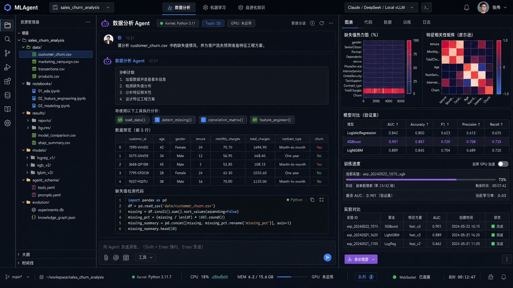
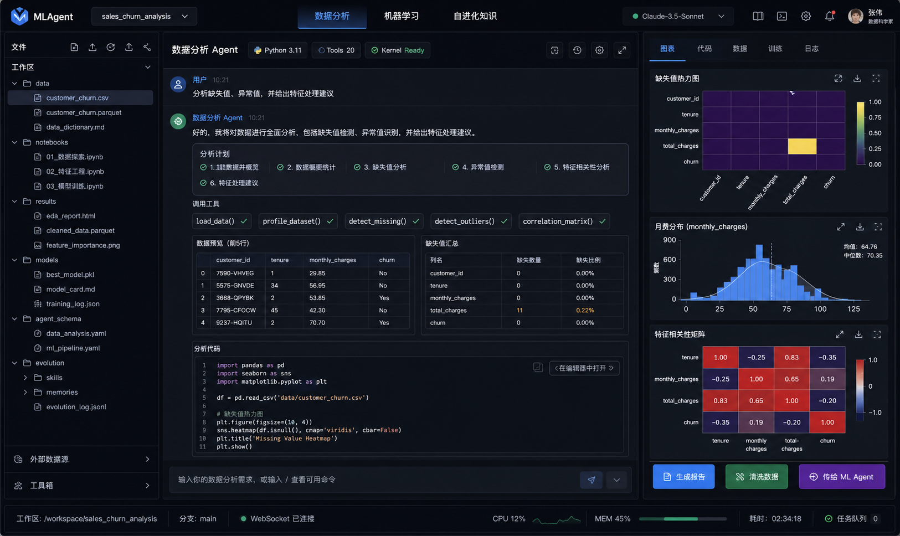
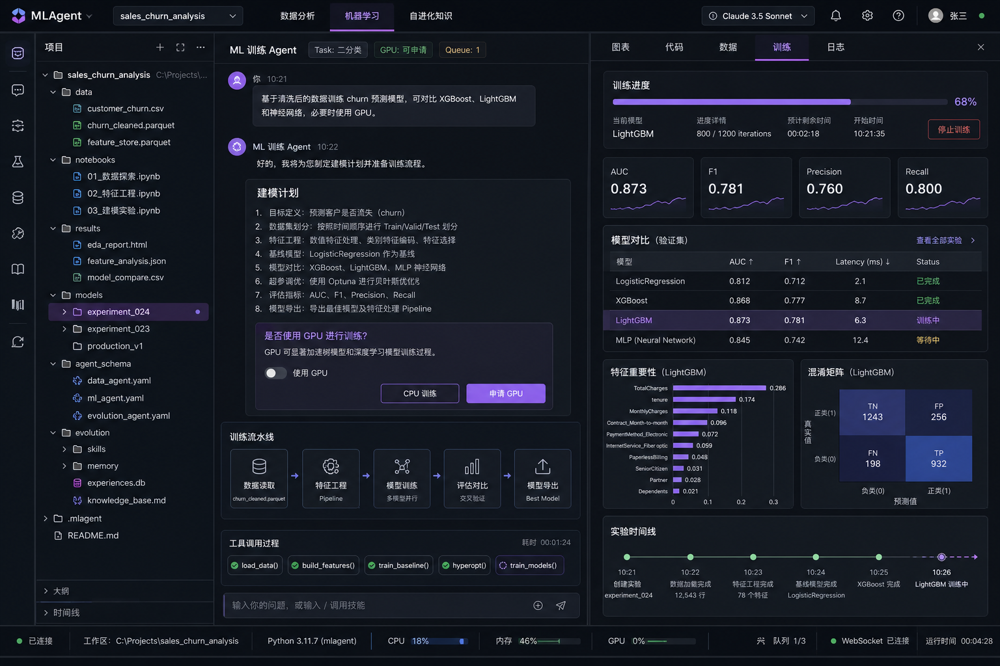
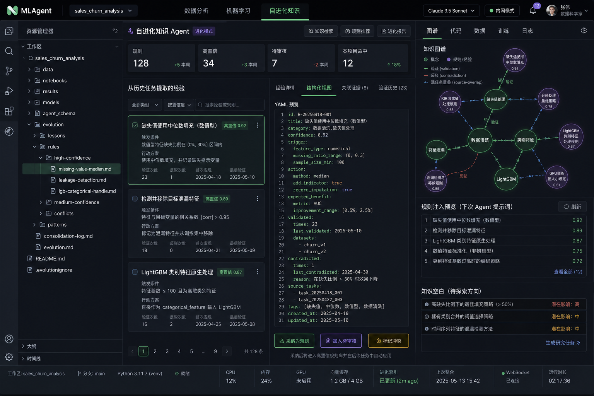
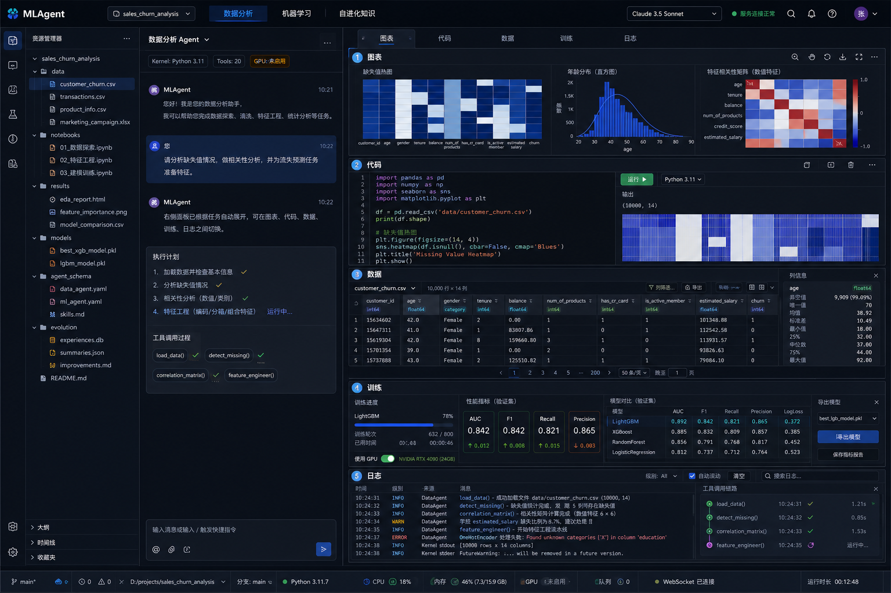
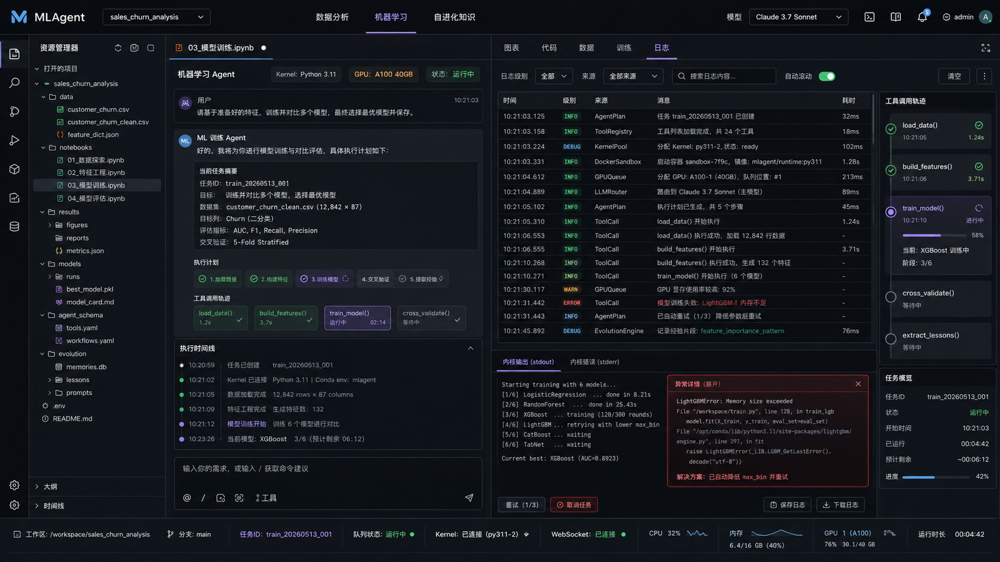
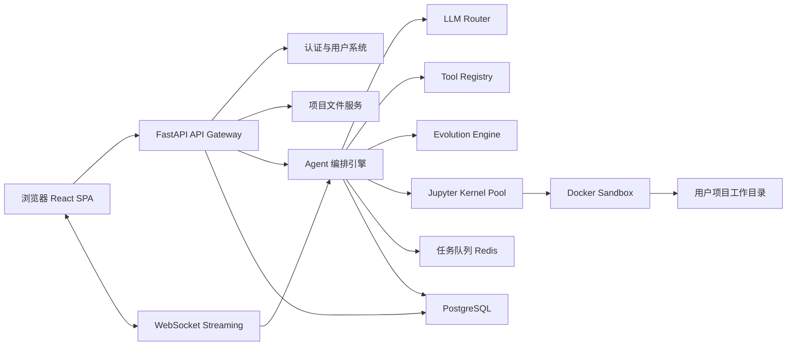
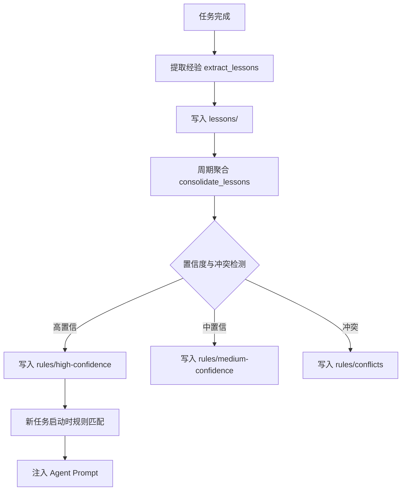

# MLAgent UI Demo 功能设计与开发文档

> 基于当前 UI demo、`design-spec.md`、Agent Harness、自进化知识系统和右侧动态面板设计整理。本文用于后续代码开发时拆分模块、确定依赖、排期和验收标准。

## 1. 文档目标

本文把 UI demo 中已经出现的产品能力拆成可开发功能，并给出推荐开发顺序。目标是让后续实现时避免“先画界面、再临时补能力”的漂移，保证前端交互、后端 API、Agent 编排、Kernel 执行和自进化知识系统能按依赖逐层落地。

## 1.1 当前实现进度（2026-05-22）

当前项目已经从静态 UI demo 推进为可运行的前后端工作台，核心骨架、项目文件管理、Agent 会话、右侧结果面板、数据分析/机器学习 MVP、自进化知识 MVP 已进入可验证阶段。

| 阶段 | 状态 | 已落地能力 | 后续重点 |
|---|---|---|---|
| Phase 0-2 项目骨架与 IDE 工作台 | 已完成 MVP | React/Vite 前端、FastAPI 后端、三栏 IDE 布局、顶部模式切换、左侧项目/文件区、右侧图表/代码/数据/训练/日志面板 | 继续做视觉一致性和响应式细节 |
| Phase 3 Agent 会话与 WebSocket | 已完成 MVP | 会话列表、历史消息、事件流、任务进度、产物事件、日志面板联动 | 增加中止/重试/长任务恢复体验 |
| Phase 4 Kernel 执行 | 已完成本地与接口层，Docker/Jupyter 持续完善 | `KernelServiceProtocol`、本地执行、测试覆盖，Docker/Jupyter 真实沙箱作为后续硬化方向 | 强化容器隔离、资源限制、Kernel 池管理 |
| Phase 5 数据分析 Agent MVP | 已完成 MVP | CSV 加载、profile、缺失值检测、报告生成、清洗产物、右侧图表/数据/代码同步 | 扩展 Excel/Parquet、大文件采样、更多分析工具 |
| Phase 6 机器学习 Agent MVP | 已完成 MVP | baseline/sklearn 训练、模型对比、产物保存、训练记录、可选 GPU 参数链路 | 增强 AutoML、特征工程流水线、模型导出与推理入口 |
| Phase 7 日志与可观测性 | 已完成 MVP | 右侧日志面板、事件筛选、JSONL 导出、工具/Kernal/Artifact 事件可视化 | 引入 trace id、耗时聚合、异常详情跳转 |
| Phase 8 自进化知识 MVP | 已完成主要闭环 | 候选经验抽取、采纳/拒绝/冲突、规则索引、规则命中、注入日志、协议展示、前端审核工作区 | 增加更多经验模板和人工审核批处理 |
| Phase 9 GPU 调度 | 部分完成 | GPU 调度服务、状态 API、队列测试、前端训练参数可传 `use_gpu` | 接入真实 GPU worker、取消/超时释放、前端排队状态 |
| Phase 10 知识图谱与高级洞察 | 部分完成 | `/evolution/graph` API、图谱节点/边、知识空白/惊奇连接、前端图谱/洞察视图、空态和错误态 | 将节点定位到文件/实验/日志，增加图谱布局和证据面板 |

最近一次验证结果：

- 后端：`.venv\Scripts\python.exe -m pytest -q`，结果 `73 passed, 3 skipped`。
- 前端：`npm test`、`npm run lint`、`npx tsc -b --pretty false`、`npm run build` 均通过。
- 浏览器：Edge headless 打开 `http://127.0.0.1:5174/`，进入“自进化知识 -> 自进化知识图谱 & 高级洞察”截图验证通过。

## 2. UI Demo 视觉参考

| 编号 | 页面 | 图片 |
|---|---|---|
| 00 | 主工作台总览 | `docs/design/ui-demo/00-main-workbench.png` |
| 01 | 数据分析页 | `docs/design/ui-demo/01-data-analysis.png` |
| 02 | 机器学习页 | `docs/design/ui-demo/02-machine-learning.png` |
| 03 | 自进化知识页 | `docs/design/ui-demo/03-evolution-knowledge.png` |
| 04 | 右侧多面板总览 | `docs/design/ui-demo/04-right-panel-gallery.png` |
| 05 | 执行日志页 | `docs/design/ui-demo/05-execution-logs.png` |

### 2.1 页面预览













## 3. 产品信息架构

MLAgent 是一个企业内部 AI IDE，主页面由五个稳定区域组成：

1. 顶部导航栏：项目选择、主功能入口、模型选择、用户入口。
2. 左侧项目文件区：展示用户项目内的数据、notebook、结果、模型、Agent Schema、自进化经验。
3. 中间 Agent 工作区：以对话方式驱动数据分析、机器学习训练和知识审核。
4. 右侧动态结果面板：根据任务自动切换图表、代码、数据、训练、日志等工作视图。
5. 底部状态栏：展示 Kernel、WebSocket、CPU/MEM/GPU、任务队列和当前耗时。

主功能入口包含：

- 数据分析
- 机器学习
- 自进化知识

右侧结果面板包含：

- 图表
- 代码
- 数据
- 训练
- 日志

## 4. 总体技术架构

推荐沿用当前方案 C：



关键原则：

- 前端只负责交互和渲染，不直接执行用户代码。
- 后端所有代码执行都进入隔离 Kernel。
- 高频数据分析能力优先走预置工具，复杂任务再由 LLM 生成代码。
- 长任务必须异步化，训练、批量分析、经验聚合都进入任务队列。
- 自进化规则必须有人类审核或置信度门槛，不能让 Agent 无限制改写自身行为。

## 5. 页面与功能设计

### 5.1 顶部导航栏

功能：

- 展示产品名 `MLAgent`。
- 选择当前项目，例如 `sales_churn_analysis`。
- 切换主功能页：数据分析、机器学习、自进化知识。
- 选择 LLM 模型：Claude、DeepSeek、OpenAI、本地 vLLM。
- 展示当前用户、设置入口、通知状态。

前端组件：

- `AppShell`
- `TopNav`
- `ProjectSwitcher`
- `MainModeTabs`
- `ModelSelector`
- `UserMenu`

后端依赖：

- 用户登录态 API。
- 项目列表 API。
- LLM Provider 配置 API。

验收标准：

- 切换主功能页时不刷新整个应用。
- 当前项目、当前模型和当前功能页可持久化。
- 企业内网场景下支持用户退出和重新登录。

### 5.2 左侧项目文件区

文件结构：

```text
workspaces/{user_id}/{project_id}/
├── data/
├── notebooks/
├── results/
├── models/
├── agent_schema/
├── evolution/
├── index.md
└── log.md
```

功能：

- 展示项目目录树。
- 上传、下载、重命名、删除文件。
- 预览 CSV、Excel、JSON、Markdown、图片、模型文件元信息。
- 支持右键菜单：打开、复制路径、设为当前数据集、传给 Agent、删除。
- 标识当前 Agent 正在使用的文件。

前端组件：

- `FileExplorer`
- `FileTreeNode`
- `FileContextMenu`
- `UploadDropzone`
- `FilePreviewDrawer`

后端 API：

```http
GET    /api/projects
POST   /api/projects
GET    /api/projects/{project_id}/files
POST   /api/projects/{project_id}/files/upload
GET    /api/projects/{project_id}/files/content?path=
PATCH  /api/projects/{project_id}/files/rename
DELETE /api/projects/{project_id}/files?path=
```

开发注意：

- 路径必须做 workspace 沙箱校验，禁止 `../` 路径逃逸。
- 上传大文件需要分片或至少支持进度条。
- 文件删除先进入回收站或二次确认。

### 5.3 中间 Agent 工作区

通用能力：

- 对话消息流。
- 工具调用过程可视化。
- 分析计划卡片。
- 代码块、表格、图表、文件链接渲染。
- 支持中止当前任务、重试、继续追问。
- 支持将 Agent 产物保存到项目文件夹。

前端组件：

- `AgentWorkspace`
- `ChatMessageList`
- `MessageComposer`
- `ToolCallChip`
- `PlanCard`
- `InlineDataFrame`
- `InlineCodeBlock`
- `ArtifactLink`

WebSocket 事件：

```ts
type AgentStreamEvent =
  | { type: "message_delta"; message_id: string; delta: string }
  | { type: "tool_call_started"; call_id: string; tool: string; args: unknown }
  | { type: "tool_call_finished"; call_id: string; status: "success" | "error"; result_ref?: string }
  | { type: "kernel_output"; stream: "stdout" | "stderr"; text: string }
  | { type: "artifact_created"; artifact: Artifact }
  | { type: "task_progress"; task_id: string; progress: number; label: string }
  | { type: "lesson_extracted"; lesson_id: string; confidence: number }
  | { type: "error"; code: string; message: string };
```

后端模块：

- `AgentSessionService`
- `AgentOrchestrator`
- `ToolRegistry`
- `LLMRouter`
- `KernelExecutionService`
- `ArtifactService`

验收标准：

- 用户发送消息后，Agent 回复必须流式展示。
- 工具调用状态必须可见，失败时能展开错误原因。
- 代码执行输出、表格、图表能作为 artifact 保存并在右侧面板打开。

## 6. 数据分析页设计

### 6.1 用户场景

用户上传或选择数据集后，通过自然语言要求 Agent 做 EDA、清洗、异常检测、特征建议和报告生成。

典型请求：

> 分析缺失值、异常值，并给出特征处理建议。

### 6.2 核心功能

1. 数据集加载与概要识别。
2. 缺失值检测。
3. 异常值检测。
4. 分布分析。
5. 相关性分析。
6. 数据类型推断。
7. 特征工程建议。
8. 清洗脚本生成。
9. 清洗后数据保存。
10. 一键传给 ML Agent。

### 6.3 默认工具

```yaml
tools:
  - load_data
  - profile_dataset
  - infer_schema
  - detect_missing
  - detect_outliers
  - correlation_matrix
  - plot_distribution
  - feature_engineer
  - clean_data
  - generate_report
```

### 6.4 右侧图表面板

图表面板需要支持：

- 缺失值热力图。
- 分布直方图。
- 箱线图。
- 相关矩阵。
- 类别占比图。
- 时间序列趋势图。
- 图表下载。
- 全屏查看。

建议技术：

- 前端交互图表：Plotly.js。
- 服务端高质量导出：Matplotlib / Seaborn。
- 图表 artifact 统一存储为 JSON + PNG 两种形式。

### 6.5 后端数据结构

```sql
projects(id, owner_id, name, workspace_path, created_at, updated_at)
datasets(id, project_id, file_path, sha256, row_count, column_count, schema_json, profile_json, created_at)
artifacts(id, project_id, session_id, type, name, file_path, metadata_json, created_at)
```

### 6.6 验收标准

- 选择 CSV 后 5 秒内展示基础概要。
- 缺失值、字段类型、行列数、样例数据可见。
- Agent 能生成可执行清洗代码，并保存清洗后文件。
- 同一数据文件未变化时，重复概要分析命中缓存。

## 7. 机器学习页设计

### 7.1 用户场景

用户在完成数据分析后，要求 Agent 基于清洗后的数据构建、训练和比较模型。用户可以选择是否使用 GPU。

典型请求：

> 基于清洗后的数据训练 churn 预测模型，可对比 XGBoost、LightGBM 和神经网络，必要时使用 GPU。

### 7.2 核心功能

1. 目标列选择。
2. 任务类型识别：分类、回归、排序、聚类。
3. 训练/验证/测试集切分。
4. 特征处理 Pipeline。
5. Baseline 模型训练。
6. 多模型对比。
7. 超参数调优。
8. GPU 申请与任务排队。
9. 模型评估与解释。
10. 模型导出。

### 7.3 默认工具

```yaml
tools:
  - prepare_ml_dataset
  - infer_ml_task
  - train_test_split
  - build_feature_pipeline
  - train_model
  - auto_ml
  - tune_hyperparams
  - compare_models
  - feature_importance
  - export_model
```

### 7.4 训练面板

训练面板需要展示：

- 当前任务状态。
- 训练进度条。
- 当前模型。
- 指标卡片：AUC、F1、Precision、Recall、RMSE 等。
- 模型对比表。
- 特征重要性。
- 混淆矩阵。
- 实验时间线。
- GPU 开关和队列状态。

### 7.5 GPU 设计

GPU 不是默认启用能力，应设计为显式申请：

1. Agent 判断任务可能受益于 GPU。
2. Agent 询问用户是否申请 GPU。
3. 用户确认后进入 GPU 队列。
4. 后端分配 GPU 容器。
5. 训练结束后释放资源。

GPU API：

```http
GET  /api/resources/gpu/status
POST /api/tasks/{task_id}/request-gpu
POST /api/tasks/{task_id}/release-gpu
```

### 7.6 实验数据结构

```sql
experiments(id, project_id, session_id, name, task_type, target_column, status, created_at)
model_runs(id, experiment_id, model_name, params_json, metrics_json, artifact_path, status, started_at, finished_at)
training_tasks(id, project_id, experiment_id, queue_name, status, progress, resource_json, logs_path, created_at)
```

### 7.7 验收标准

- 能从数据分析产物一键创建 ML 实验。
- 至少支持 sklearn LogisticRegression、RandomForest、XGBoost/LightGBM 中的两个模型。
- 训练过程状态实时更新。
- 模型对比表可排序。
- 最佳模型可导出到 `models/`。

## 8. 自进化知识页设计

### 8.1 用户场景

平台从历史数据分析和建模任务中自动提取经验，沉淀为可复用规则，在后续任务中自动注入 Agent 上下文，使 Agent 越用越准确。

### 8.2 页面功能

- 展示经验库目录。
- 展示高置信规则、中置信规则、冲突规则。
- 审核 Agent 提取的新经验。
- 查看经验 YAML。
- 查看知识图谱。
- 查看本项目命中的规则。
- 将经验采纳为规则。
- 标记经验冲突或过期。

### 8.3 经验结构

```yaml
type: lesson
id: missing-value-median-001
domain: [数据清洗, 缺失值处理]
trigger_condition: "数值列 | 缺失率 < 10% | 偏度 > 1.5"
action: "优先使用中位数填充，而不是均值"
rationale: "右偏分布下中位数比均值更稳健"
evidence:
  - project_id: sales_churn_analysis
    task_id: eda_20260513_001
confidence: 3
times_validated: 5
times_contradicted: 0
status: high-confidence
```

### 8.4 自进化闭环



### 8.5 后端模块

- `LessonExtractor`
- `LessonStore`
- `RuleConsolidator`
- `RuleMatcher`
- `PromptInjector`
- `ConflictDetector`
- `KnowledgeGraphBuilder`

### 8.6 验收标准

- 每次完整任务结束后，系统能生成候选经验。
- 候选经验进入待审核状态，不直接污染高置信规则。
- 同一类经验被多次验证后可升级为高置信规则。
- 新任务启动时能展示“本次命中的历史经验”。

## 9. 右侧动态面板设计

右侧面板是 MLAgent 的关键生产力区域。它不是固定展示区，而是 Agent 产物的上下文面板。

### 9.1 图表 Tab

功能：

- 展示 Plotly 交互图。
- 支持缩放、框选、下载、全屏。
- 支持多个图表缩略导航。
- 支持从 Agent 消息点击 artifact 自动定位。

核心组件：

- `ChartPanel`
- `ChartToolbar`
- `ChartArtifactCard`

### 9.2 代码 Tab

功能：

- 展示 Agent 生成的 Python 代码。
- 支持运行代码块。
- 支持保存到 `notebooks/` 或 `.py` 文件。
- 支持 Kernel stdout/stderr 输出预览。

核心组件：

- `CodePanel`
- `PythonEditor`
- `RunCellButton`
- `KernelOutput`

建议技术：

- Monaco Editor。
- Jupyter Kernel WebSocket 执行桥。

### 9.3 数据 Tab

功能：

- DataFrame 表格查看。
- 列筛选、排序、搜索。
- 列类型标签。
- 列 profile 侧栏。
- 分页与虚拟滚动。

核心组件：

- `DataPanel`
- `DataGrid`
- `ColumnProfiler`
- `SchemaBadge`

建议技术：

- TanStack Table 或 AG Grid Community。
- 大数据只加载分页/采样，不把全量数据推到前端。

### 9.4 训练 Tab

功能：

- 训练进度。
- 指标卡片。
- 模型对比。
- GPU 状态。
- 实验 timeline。
- 模型导出。

核心组件：

- `TrainingPanel`
- `MetricsCard`
- `ModelComparisonTable`
- `TrainingTimeline`

### 9.5 日志 Tab

功能：

- 流式结构化日志。
- 按级别、来源、关键词筛选。
- 工具调用 trace。
- Kernel stdout/stderr。
- 异常详情展开。
- 保存日志。

核心组件：

- `LogPanel`
- `LogTable`
- `TraceTimeline`
- `ExceptionCard`

日志事件结构：

```ts
type LogEvent = {
  id: string;
  timestamp: string;
  level: "DEBUG" | "INFO" | "WARN" | "ERROR";
  source: "AgentPlan" | "ToolRegistry" | "KernelPool" | "DockerSandbox" | "GPUQueue" | "LLMRouter" | "EvolutionEngine";
  message: string;
  duration_ms?: number;
  task_id?: string;
  trace_id?: string;
};
```

## 10. 开发顺序设计

下面顺序按“依赖关系优先、核心闭环优先、复杂能力后置”的原则设计。

### Phase 0：项目初始化与基础规范

重要程度：最高  
难度：低  
依赖：无

目标：

- 建立前后端项目结构。
- 建立代码规范、类型规范、环境配置。
- 确定 Dark Precision 设计 token。

任务：

- 初始化 `frontend/`：React + TypeScript + Vite。
- 初始化 `backend/`：FastAPI + uv/poetry。
- 建立 `docker-compose.yml`：PostgreSQL、Redis。
- 建立基础 CI：lint、typecheck、test。
- 建立前端路由和 AppShell 空布局。

验收：

- 本地一条命令启动前后端。
- 前端能看到空的 IDE 框架。
- 后端 `/health` 正常。

### Phase 1：用户、项目与文件系统

重要程度：最高  
难度：中  
依赖：Phase 0

目标：

- 支持企业内部用户登录。
- 支持项目创建和文件管理。
- 跑通左侧项目文件区。

任务：

- 用户表、项目表、会话表。
- JWT 登录。
- 工作目录创建和路径安全校验。
- 文件上传、读取、删除、重命名。
- 前端 FileExplorer。

验收：

- 用户登录后能创建项目。
- 能上传 CSV 并在左侧显示。
- 文件路径不能逃逸用户 workspace。

### Phase 2：静态 UI 工作台与右侧面板框架

重要程度：高  
难度：中  
依赖：Phase 1

目标：

- 实现 UI demo 的主框架。
- 右侧五个 Tab 具备真实组件骨架。

任务：

- TopNav、MainModeTabs、底部状态栏。
- AgentWorkspace 空状态。
- RightPanel：图表、代码、数据、训练、日志 Tab。
- 响应式宽度和折叠行为。
- 主题 token、组件状态、暗色样式。

验收：

- 页面结构与 UI demo 基本一致。
- 切换主功能和右侧 Tab 无刷新。
- 所有面板有稳定空状态。

### Phase 3：Agent 会话与 WebSocket 流式通信

重要程度：最高  
难度：中高  
依赖：Phase 1、Phase 2

目标：

- 用户能在中间对话区与 Agent 交互。
- 后端能推送 message delta、tool event、artifact event。

任务：

- 会话 CRUD。
- WebSocket 连接管理。
- AgentStreamEvent 协议。
- 前端流式消息渲染。
- 中止、重试、继续对话。

验收：

- 发送消息后可看到流式回复。
- 断线重连后不丢失历史消息。
- 日志 Tab 能显示基础 WebSocket 事件。

### Phase 4：Jupyter Kernel 与代码执行

重要程度：最高  
难度：高  
依赖：Phase 3

目标：

- Agent 生成或工具产生的 Python 代码能在隔离 Kernel 中运行。
- stdout、stderr、图表、DataFrame 能回传前端。

任务：

- Docker Sandbox 镜像。
- Kernel Pool。
- 工作目录挂载。
- 代码执行 API。
- Kernel 输出转 artifact。
- CodePanel 运行代码块。

验收：

- 能执行 pandas 读取项目中的 CSV。
- 能返回 DataFrame 预览。
- 能生成并展示一张 Matplotlib/Plotly 图。
- 单用户 Kernel 崩溃后可重启。

### Phase 5：数据分析 Agent MVP

重要程度：最高  
难度：高  
依赖：Phase 4

目标：

- 跑通“上传数据 -> 对话分析 -> 图表/表格/代码产物 -> 保存结果”的核心闭环。

任务：

- ToolRegistry。
- 数据分析 Agent prompt。
- `load_data`、`profile_dataset`、`detect_missing`、`correlation_matrix`、`plot_distribution`。
- 缓存数据 profile。
- ChartPanel、DataPanel 接入真实 artifact。

验收：

- 用户可以要求分析缺失值。
- 右侧图表面板显示真实热力图或统计图。
- 数据面板显示真实表格预览。
- Agent 能保存分析报告到 `results/`。

### Phase 6：机器学习 Agent MVP

重要程度：高  
难度：高  
依赖：Phase 5

目标：

- 跑通“从分析结果进入建模 -> 训练多个模型 -> 对比指标 -> 导出模型”的闭环。

任务：

- ML Agent prompt。
- `prepare_ml_dataset`、`infer_ml_task`、`train_model`、`compare_models`、`export_model`。
- 异步训练任务队列。
- TrainingPanel 接入真实进度。
- ModelComparisonTable。

验收：

- 支持一个二分类数据集训练 baseline。
- 至少两个模型可对比。
- 训练状态实时更新。
- 最佳模型能导出到 `models/`。

### Phase 7：日志与可观测性

重要程度：高  
难度：中  
依赖：Phase 3、Phase 4、Phase 6

目标：

- 让复杂 Agent 任务可追踪、可调试、可审计。

任务：

- 统一 LogEvent。
- Trace ID 贯穿 Agent、Tool、Kernel、Queue。
- LogPanel 筛选、搜索、自动滚动。
- 异常详情卡。
- 日志保存到项目 `logs/` 或数据库。

验收：

- 每个工具调用都有开始、结束、耗时、状态。
- Kernel 错误能在日志面板展开。
- 训练任务日志可保存。

### Phase 8：自进化知识 MVP

重要程度：高  
难度：高  
依赖：Phase 5、Phase 6、Phase 7

目标：

- 从任务中提取候选经验，进入审核区，并在新任务中注入命中的高置信规则。

任务：

- LessonExtractor。
- Lesson YAML 文件存储。
- Evolution 文件树。
- 自进化知识页。
- 规则审核 UI。
- RuleMatcher 和 PromptInjector。

验收：

- 数据分析或训练任务结束后生成候选经验。
- 用户能采纳、拒绝、标记冲突。
- 新任务开始前展示命中的历史经验。

### Phase 9：GPU 调度与高级训练

重要程度：中高  
难度：高  
依赖：Phase 6

目标：

- 支持用户显式申请 GPU 资源。
- 支持深度学习或 GPU 加速模型。

任务：

- GPU 资源状态 API。
- GPU 任务队列。
- GPU Docker 镜像。
- 申请/释放流程。
- 前端 GPU toggle 和排队提示。

验收：

- 用户可选择 CPU 或 GPU 训练。
- GPU 忙碌时任务进入队列。
- 训练结束自动释放资源。

### Phase 10：知识图谱与高级洞察

重要程度：中  
难度：高  
依赖：Phase 8

目标：

- 将数据特征、模型实验和经验规则关联成图。

任务：

- 数据关联图谱。
- 模型关联图谱。
- 经验规则图谱。
- 图谱可视化。
- 知识空白和惊奇连接检测。

验收：

- 自进化知识页能展示真实节点和边。
- 点击节点能定位到来源任务、经验或模型实验。
- 能生成至少一种“知识空白”建议。

## 11. 推荐 MVP 范围

第一版不要试图一次性做完所有 demo 能力。推荐 MVP 包含：

- 登录。
- 项目管理。
- 文件上传和文件树。
- 三栏 IDE 布局。
- Agent 对话流。
- Jupyter Kernel 执行。
- 数据分析 Agent 的 5 个核心工具。
- 图表、代码、数据、日志 4 个右侧面板。
- 一个基础 ML 训练流程。

暂缓到 MVP 后：

- GPU 调度。
- 高级 AutoML。
- 完整自进化规则升华。
- 知识图谱。
- 多租户企业权限细分。

## 12. 前端组件拆分建议

```text
frontend/src/
├── app/
│   ├── AppShell.tsx
│   ├── routes.tsx
│   └── providers.tsx
├── features/
│   ├── projects/
│   ├── files/
│   ├── chat/
│   ├── agent/
│   ├── charts/
│   ├── code/
│   ├── data-grid/
│   ├── training/
│   ├── logs/
│   └── evolution/
├── components/
│   ├── ui/
│   └── layout/
├── lib/
│   ├── api.ts
│   ├── websocket.ts
│   └── theme.ts
└── types/
```

## 13. 后端模块拆分建议

```text
backend/app/
├── main.py
├── api/
│   ├── auth.py
│   ├── projects.py
│   ├── files.py
│   ├── sessions.py
│   ├── agents.py
│   ├── tasks.py
│   └── resources.py
├── core/
│   ├── config.py
│   ├── security.py
│   └── logging.py
├── services/
│   ├── workspace_service.py
│   ├── agent_orchestrator.py
│   ├── tool_registry.py
│   ├── llm_router.py
│   ├── kernel_service.py
│   ├── artifact_service.py
│   ├── training_service.py
│   └── evolution_service.py
├── tools/
│   ├── data_analysis/
│   └── machine_learning/
├── models/
└── schemas/
```

## 14. 风险与工程约束

| 风险 | 影响 | 处理方式 |
|---|---|---|
| 用户代码执行风险 | 高 | Docker 隔离、资源限制、路径校验 |
| 大文件上传和预览卡顿 | 高 | 分片上传、采样预览、虚拟滚动 |
| Agent 胡乱生成代码 | 高 | 工具优先、计划确认、代码执行沙箱 |
| GPU 资源争抢 | 中高 | 显式申请、队列、超时释放 |
| 自进化规则污染 | 高 | 候选经验审核、置信度门槛、冲突检测 |
| 图表和表格前端性能 | 中 | Artifact 引用、分页、懒加载 |
| 日志过多 | 中 | Trace 聚合、筛选、日志归档 |

## 15. 测试策略

后端：

- 单元测试：工具函数、路径校验、数据 profile。
- 集成测试：文件上传、Kernel 执行、WebSocket 事件。
- 安全测试：路径逃逸、非法文件名、资源限制。
- 长任务测试：训练队列、中止、重试、崩溃恢复。

前端：

- 组件测试：FileExplorer、RightPanel、MessageList。
- E2E 测试：上传 CSV -> 发送分析请求 -> 查看图表 -> 保存结果。
- 可视化回归：主工作台、数据分析页、训练页、日志页。

Agent：

- Promptfoo 或自建 eval：缺失值分析、目标列识别、模型选择、经验提取。
- Golden dataset：固定输入数据集和期望输出。
- Tool contract test：每个工具输入输出 schema 必须稳定。

## 16. 下一步建议

建议下一步进入 Phase 0 和 Phase 1，先把真实项目骨架搭起来：

1. 创建 `frontend/` React + TypeScript + Vite。
2. 创建 `backend/` FastAPI。
3. 创建 `docker-compose.yml`，包含 PostgreSQL 和 Redis。
4. 实现 UI demo 的静态 AppShell。
5. 实现项目和文件管理 API。

这一步完成后，UI demo 会从图片和 HTML 原型，变成可以持续迭代的真实应用骨架。
